<div align="center">


# 🌱 AgriLink — Bharat's Farmer-Direct Quick-Commerce

## 🟢 ▶ **OPEN THE LIVE APP:** [**https://f160t8hueub0-d.space-z.ai**](https://f160t8hueub0-d.space-z.ai) 🟢

<a href="https://f160t8hueub0-d.space-z.ai"></a>
<a href="https://f160t8hueub0-d.space-z.ai"></a>
<a href="https://arpitnayan123-bot.github.io/Agri-link/"></a>
<a href="#-demo-video"></a>
<a href="#-screenshot-gallery"></a>


<br>


</div>

## 🎬 Demo Video

<div align="center">

**The full 90-second journey — browse → basket → coupon → UPI pay → instant farmer payouts → live tracking:**

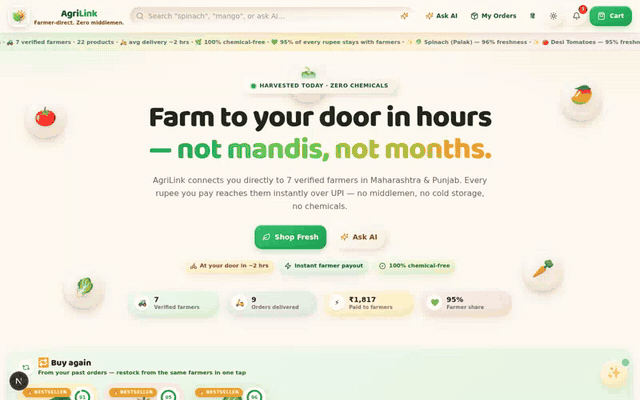

<sub>🔁 Loops automatically · <a href="docs/demo-agrilink.mp4">▶ Watch the full-quality MP4 (90s)</a></sub>

</div>

## 📸 Screenshot Gallery

<div align="center">

| ☀️ Market — Claymorphism Home | 🌙 Forest-Night Dark Mode |
| :---: | :---: |
| 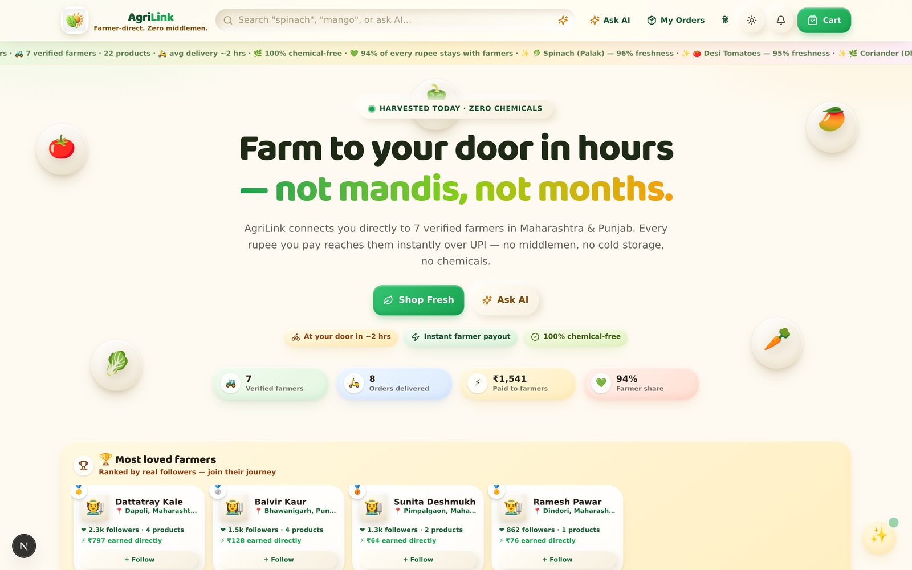 | 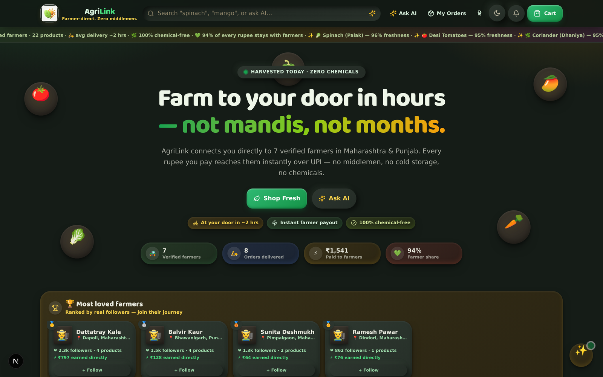 |
| **⚡ Live stats, farmer leaderboard, freshness marquee** | **Every clay & neumorphic surface re-tuned for night** |

| 🧺 Freshness-Rated Catalog | 👨‍🌾 Farmer Storefront |
| :---: | :---: |
| 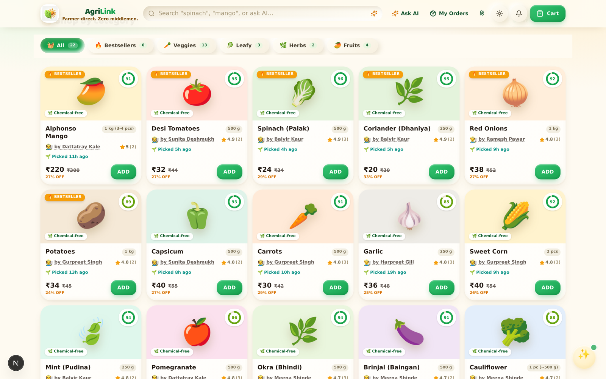 | 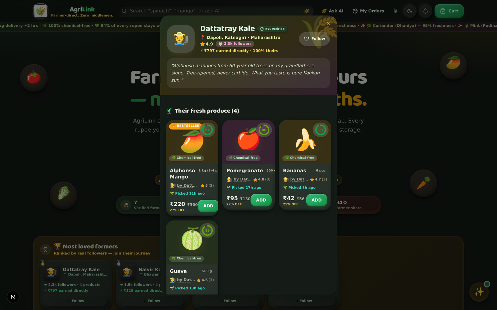 |
| **Ring scores · harvested-ago · KYC farmer on every card** | **KYC badge · story · lifetime direct earnings · follow** |

| 🛒 Basket with Payout Preview | 🧾 Instant Payout Receipt |
| :---: | :---: |
| 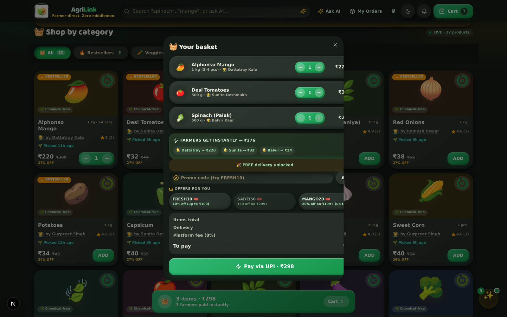 | 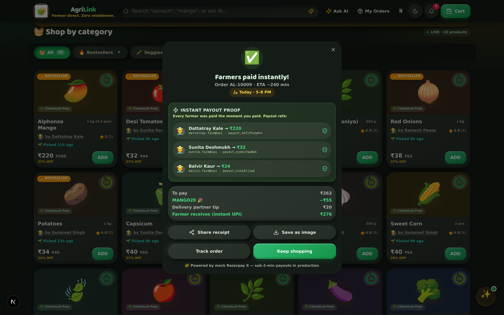 |
| **"Farmers get instantly — ₹276" before you even pay** | **Per-farmer payout refs + coupon + tip + confetti 🎊** |

| 📍 Delivery Scheduling | 🛵 Live Order Tracking |
| :---: | :---: |
| 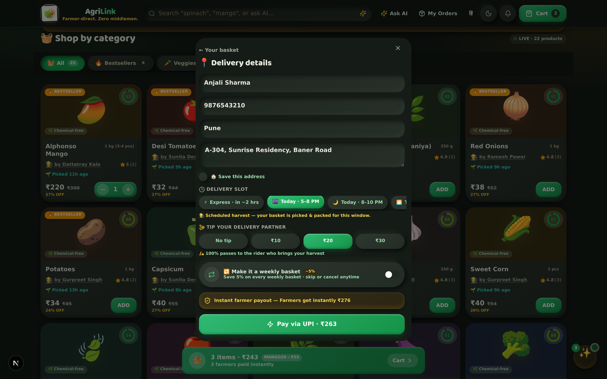 | 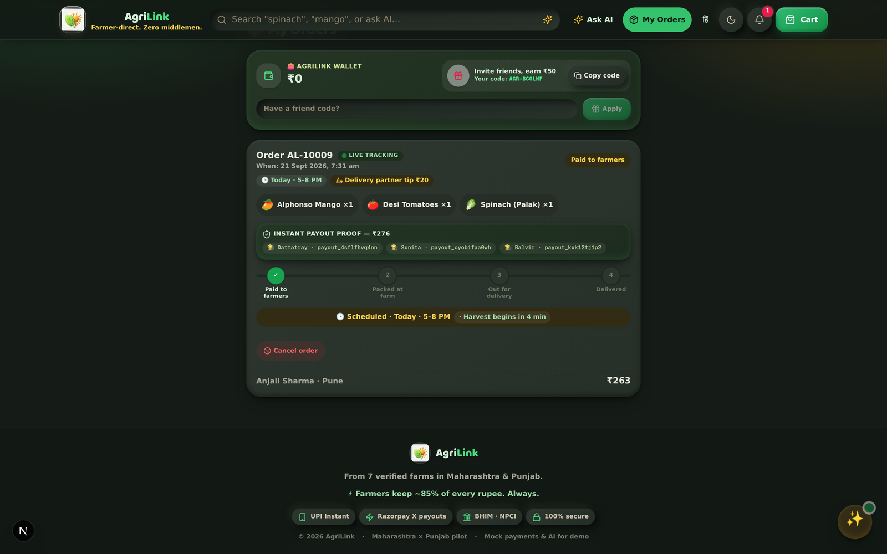 |
| **Express ~2h or scheduled windows + rider tip** | **Payout pills on the timeline · cancel with refund** |

</div>

<details>
<summary><b>👀 More — mobile, orders, coupons, how-it-works (click to expand)</b></summary>
<br>

<div align="center">

| 📱 Mobile-First 390px | 💰 Orders + AgriLink Wallet |
| :---: | :---: |
| 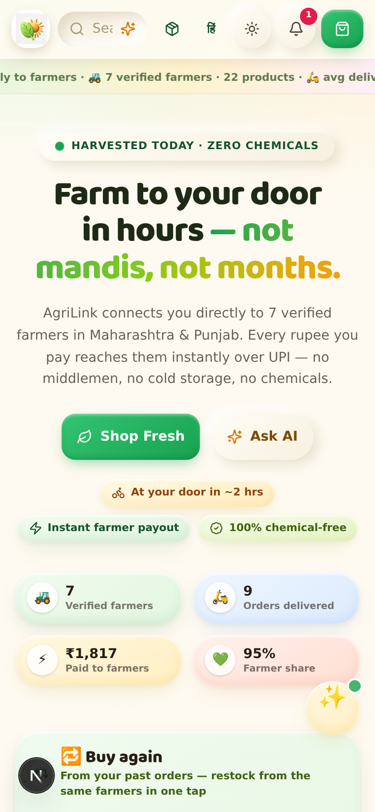 | 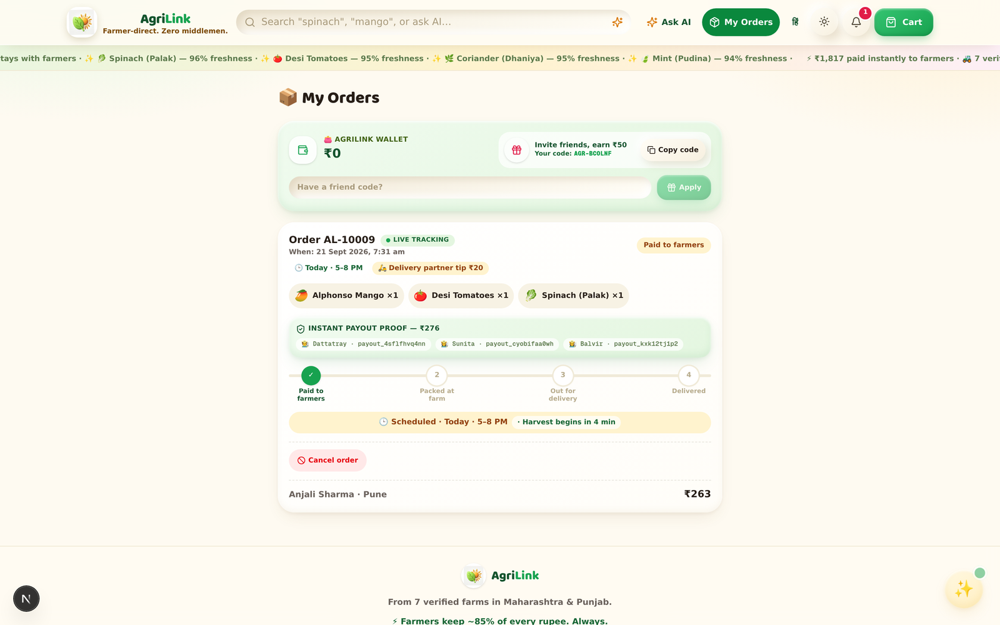 |

| 🎟️ One-Tap Coupon Book | 🚜 How AgriLink Works |
| :---: | :---: |
| 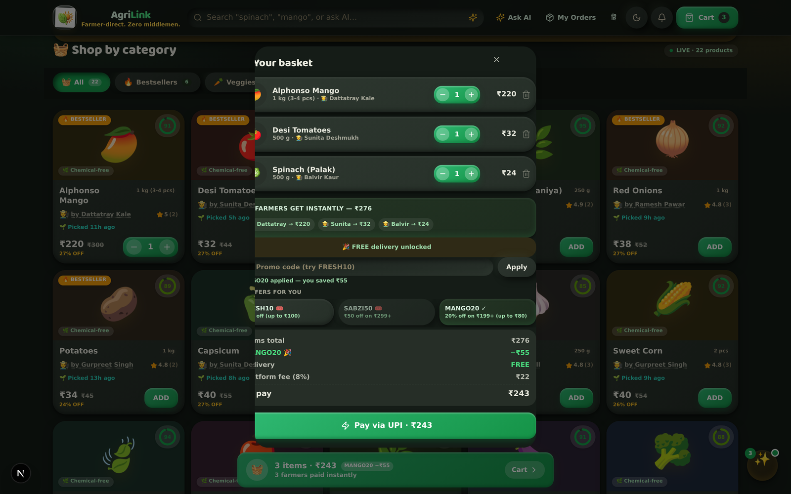 | 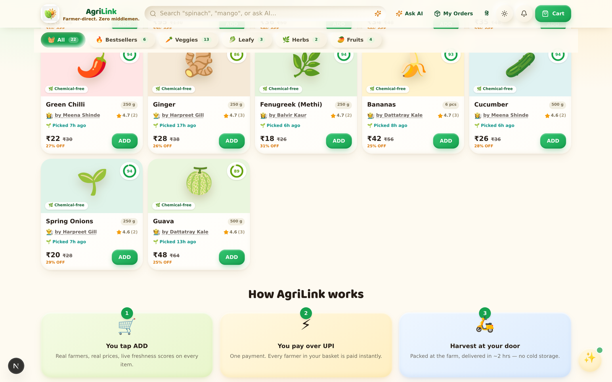 |

</div>

</details>

<div align="center">


</div>

## 💡 Why AgriLink exists

Blinkit and Zepto perfected the *delivery*. But behind every ₹32 tomato sits a mandi chain that leaves the farmer with **22–35% of your rupee** (NABARD 2023). AgriLink keeps the quick-commerce UX — and rewires the money:

> **The moment you pay over UPI, every farmer in your basket is paid instantly** — per-farmer payout refs printed on your receipt. No escrow. No net-30. No middlemen.

**Pilot:** 7 KYC-verified farmers · 22 chemical-free crops · Maharashtra + Punjab · bilingual (English / हिंदी / मराठी-ready).

## 🧮 The trust math (honest by construction)

```
consumer pays = items + ₹29 delivery (FREE above ₹249) + 8% platform fee − coupons − weekly-basket − wallet
farmer gets   = 100% of items  —  settled INSTANTLY to their UPI the moment you pay
rider gets    = 100% of your tip
```

- Coupons (`FRESH10`, `SABZI50`, `MANGO20`) and the **weekly basket (−5%)** are **platform-subsidized** — a discount never reduces the farmer's payout.
- Every order response carries **payout proof**: `{ farmerName, amountRs, payoutRef, upiId }` per farmer.
- Cancelling? Payouts are **reversed per farmer**, stock restored, money lands back in your **AgriLink wallet** instantly.

## ✨ What's inside

<details open>
<summary><b>🛍️ The market (single <code>/</code> route, view-switched)</b></summary>

| Section | What it does |
| --- | --- |
| 🤖 AI smart search | Natural-language search dropdown (LLM → local fallback) |
| 📊 Live ticker | Real stats + freshness marquee |
| 🏠 Hero | Live count-up stats (farmers, orders, ₹ paid, farmer share) |
| 🧺 Product grid | Claymorphism cards: freshness ring, chemical-free chip, harvested-ago, rating, low-stock urgency, strike MRP, springy ADD/stepper |
| 🔁 Buy-again rail | One-tap restock from your **real order history** (recency×qty weighted) |
| 🌱 Followed-farmers rail | "From the farmers you follow" — freshness-sorted harvest feed |
| 🏆 Farmer leaderboard | Ranked by **real server-counted followers**, medal chips, earnings proof |
| ✨ AI picks strip | Complement-category recommendations |
| 🌓 Dark mode | Claymorphism-aware **forest-night** theme (persisted) |

</details>

<details open>
<summary><b>💸 Money — the differentiators</b></summary>

| Feature | Detail |
| --- | --- |
| ⚡ Instant farmer payout | Mock Razorpay X split-payout on payment; per-farmer `payoutRef` + UPI id on the receipt |
| 🧾 Shareable proof | Receipt as text (Web Share/clipboard) **and** a canvas-rendered PNG |
| 🎟️ Coupon book | One-tap chips, server-validated with min-order gating |
| 💰 AgriLink wallet | Signed ledger (`WalletTx`): refunds + referral credits, spendable at checkout |
| ↩️ Honest cancellation | Payout **reversals per farmer** + stock restore + instant wallet refund |
| 🤝 Referrals | Per-phone `AGR-XXXXXX` code, ₹50 credit, own-code/double-claim guards |
| 💸 Rider tip | ₹10/20/30 — **100% passes through** |
| 🔁 Weekly basket | −5% subscription with **skip / stop / resume** management |

</details>

<details open>
<summary><b>📦 Account & lifecycle</b></summary>

| Feature | Detail |
| --- | --- |
| 🛵 Delivery slots | Express ~2h or scheduled windows — **orders hold until their window opens** |
| 🔔 Notification center | Server-persisted inbox (order/wallet/social), unread badge, mark-read |
| 📍 Saved addresses | Address book per phone, revealed live at checkout, default promotion |
| ⭐ Real reviews | DB-backed `Review` table, blended rating, write from delivered orders |
| 🚨 Issue reporting | Report on delivered orders → `OPEN` status + support notification |
| 🧠 AI assistant | Grounded chat over the live catalog; budget-enforced **picks → Add all** |
| 🗣️ Bilingual | Full English / हिंदी toggle across every surface |

</details>

## 🚀 Run it locally

> ⚡ **No setup?** The full app is deployed and running: **[https://f160t8hueub0-d.space-z.ai](https://f160t8hueub0-d.space-z.ai)** — add to basket → apply `MANGO20` → pay → watch the instant farmer payout proof.

```bash
# 1. install
bun install

# 2. create the SQLite schema (db/custom.db)
bun run db:push

# 3. dev server on :3000 — auto-seeds 7 farmers + 22 products on first request
bun run dev
```

Docker-flavoured: `docker-compose -f docker-compose.dev.yml up` → **http://localhost:3000**

Force a clean reseed anytime: `curl -X POST http://localhost:3000/api/seed`

> 🎟️ Try in the app: coupon `MANGO20` · pay → watch the **instant payout proof** · track the order live · cancel → money back in wallet · switch to हिंदी · dark mode.

## 🗄️ API (18 endpoints)

<details>
<summary><b>Expand full API table</b></summary>

| Endpoint | Method | Notes |
| --- | --- | --- |
| `/api/health` | GET | farmers/products counts |
| `/api/stats` | GET | orders, ₹ paid to farmers, farmer share %, kg delivered |
| `/api/products` | GET | `?category=&q=&recs=id1,id2` (AI-style complements) |
| `/api/orders` | GET | `?phone=` — auto-advances lifecycle (demo clock, **slot-aware gating**), returns `nextStageInMin` + `awaitingWindow` |
| `/api/orders` | POST | validate stock → mock UPI → **instant per-farmer payout** → stock decrement → payout proofs; optional `slotKey`, `subscription: WEEKLY`, `tipRs` (0/10/20/30/50), `useWallet`, coupon (`FRESH10`/`SABZI50`/`MANGO20`) |
| `/api/orders/[code]` | POST | `CANCEL` → payout reversals + stock restore + wallet refund · `ISSUE` → `OPEN` + support notification |
| `/api/ai/chat` | POST | LLM grounded in live catalog; budget-enforced; returns `{ reply, picks[] }` |
| `/api/ai/search` | POST | natural-language search (LLM keyword extraction → substring fallback) |
| `/api/reviews` | GET/POST | `?productId=` blended rating · create validated BUYER review |
| `/api/farmers/follow` | POST | `{ farmerId, follow }` → global follower counter |
| `/api/coupons` | GET | live coupon book (same table the server validates) |
| `/api/addresses` | GET/POST/DELETE | saved address book per phone |
| `/api/wallet` | GET | `?phone=` signed balance + last 25 ledger entries |
| `/api/notifications` | GET/POST | latest 20 + unread; POST marks read (all or `ids[]`) |
| `/api/referrals` | GET/POST | per-phone code + ₹50 credit on redemption (guarded) |
| `/api/subscription` | GET/POST | `SKIP` / `CANCEL` / `RESUME` weekly basket |
| `/api/seed` | POST | force reseed |
| `/api` | GET | endpoint index |

</details>

Postman: [`postman/AgriLink.postman_collection.json`](postman/AgriLink.postman_collection.json) (28 requests) · Full reference: [`docs/API.md`](docs/API.md)

## 🏗️ Architecture

```
browser ── Next.js 16 App Router (one / route, view-switched)
              │            └── src/components/agrilink/* (claymorphism UI)
              ├── /api/* (route handlers = the backend)
              │        ├── Prisma → SQLite (Farmer, Product, Order, OrderItem,
              │        │            WalletTx, Notification, Address, Review)
              │        ├── mock Razorpay X split-payout + payout reversals on cancel
              │        └── z-ai-web-dev-sdk LLM (chat/search, grounded)
              └── zustand (persist) + TanStack Query (polling)
```

Production path: SQLite → Postgres · mock payout → Razorpay X API · demo clock → logistics webhooks · simulated WhatsApp → WhatsApp Business API.

## ⚠️ Honest limitations

| Thing | State |
| --- | --- |
| Consumer UPI collect | Mock (instant, ref generated) |
| Razorpay X farmer payout | Mock — `payoutRef` shaped like the real API |
| Order lifecycle clock | Demo (150s/stage, DB-persisted) — prod = logistics webhooks |
| WhatsApp updates | Client-side simulation (labeled in UI) |
| AI chat/search | z-ai LLM with heuristic fallback; grounded in live catalog |
| Freshness score | Real math from `harvestedAt` (decays 0.75/h, floor 52) |

## 📚 Docs

- [`docs/API.md`](docs/API.md) — endpoint reference
- [`docs/TECH-JUSTIFICATION.md`](docs/TECH-JUSTIFICATION.md) · [`docs/RISK-REGISTER.md`](docs/RISK-REGISTER.md) · [`docs/NEXT-STEPS-CHECKLIST.md`](docs/NEXT-STEPS-CHECKLIST.md)
- [`worklog.md`](worklog.md) — the full 16-round build history, decision by decision

<div align="center">


### 🌾 Every rupee finds its farmer.

<a href="https://f160t8hueub0-d.space-z.ai"></a>


</div>
